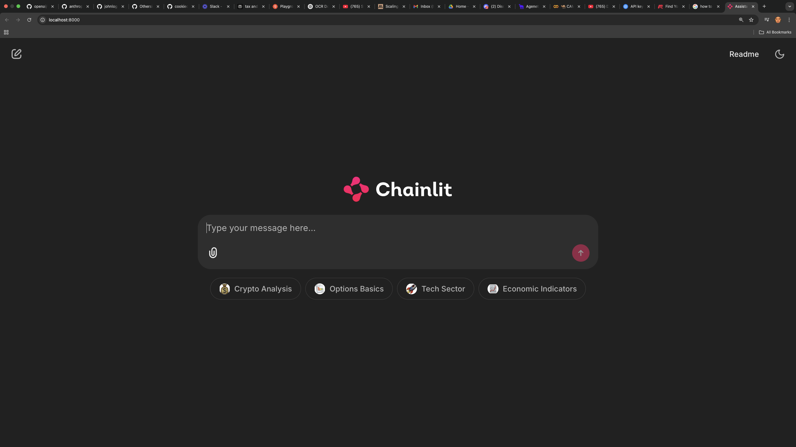

# Investor Agent

## Demo
<div align="center">
  
  
  ### [Watch Full Demo Video](https://www.loom.com/share/3cbdfdc7d6e54bb8a522080198fceebb?sid=0d76aa6a-4ccb-4c0d-9064-94ca157dd9bd)
</div>

## Table of Contents

1. [Project Vision: Goals + Purpose](#project-vision-goals--purpose)
2. [Design Principles](#design-principles)
3. [Rough Repo Structure](#repo-structure)
4. [Development Roadmap](#development-roadmap)
5. [Setup](#setup)
6. [Run pytests to confirm each component works](#run-pytests-to-confirm-each-component-works)
7. [Build and Run with Docker](#build-and-run-with-docker)
8. [Chainlit Interface](#chainlit-interface)


## Project Vision: Goals + Purpose

I want to orchestrate multiple agents into a **financial expert system**, that can answer all your queries regarding investing, whether you are looking for price metrics on a particular company, trends this week in the stock market, or timeless investing knowledge, you should be able to seamlessly hunt for these things in a pleasant natural language user interface that takes you from vague natural language to **cited, high detail answers** immediately in one place. I will be adding agents and features over time but the primary system is comprised of **finance, web and pdf index agents**, along with some intelligent use of LLMs to decipher user intent. LLMs are already great, and there's many amazing external APIs or ways to index information as tools, but My primary goal is to take natural language, and easily decipher **user intent**, as selecting the correct agent is paramount in AI and a large reason why agents haven't been able to scale until now. The whole idea is this will be your **PA for investing**, from the educational domain, all the way to automating your workflow at the financial advisory firm.

Everyone can speak English, and that's all you should need to retrieve the information you want, when you want it, and accomplish simple jobs that drain your time, on **YOUR time**. Gone should be the days of requiring software that must be learned as an intermediary between you and the information, and gone should be the days of manual, brick-laying jobs on the computer that bore and breed resentment across the workforce.

This project will use **cutting edge LLMs** and **bespoke agent orchestration** methods to create a financial advisor that works for you, no judgement, 24/7.


## Design principles

1. **Test-Driven Development (TDD)**
   - Robust test suites for all components
   - Tests drive the design and implementation
   - Ensures reliability and maintainability
   - Makes feature additions and modifications safer

2. **Strong Data Model Foundation**
   - Pydantic models for type safety and validation
   - Clear separation of data structures
   - Extensible design patterns
   - Factory methods for object creation

3. **Functional Over Object-Oriented**
   - Avoiding class hierarchies and inheritance complexity
   - Function-based design for better composability
   - Pure functions where possible for predictability
   - Factory patterns for dependency injection

4. **Minimal External Dependencies**
   - Avoiding heavy frameworks like LangChain
   - Direct integration with APIs where needed
   - Understanding and controlling our entire stack
   - Reducing vulnerability to external package changes

5. **Decoupled Architecture**
   - Clear separation of concerns
   - Factory pattern for component creation
   - Modular design for easy testing and modification
   - Main files isolated from implementation details

6. **Code Democratization**
   - Well-documented, readable code
   - Comprehensive test suites
   - Clear architectural patterns
   - Enables community understanding and contribution

7. **Maintainable Codebase**
   - Consistent coding patterns
   - Minimal code duplication
   - Clear dependency flows
   - Easy to modify and extend

## Rough Repo Structure

```
investor-agent/
├── src/
│   ├── __init__.py
│   ├── data_model.py          # Core data types and models
│   ├── intent_extraction.py   # Intent detection logic
│   ├── mock_llm.py           # Mock LLM for testing
│   ├── agents/
│   │   ├── __init__.py
│   │   ├── base.py           # Shared agent functionality
│   │   ├── pdf_agent.py      # PDF document analysis
│   │   ├── web_agent.py      # Web scraping and news
│   │   └── finance_agent.py  # Financial data and analysis
│   ├── tools/
│   │   ├── __init__.py
│   │   ├── pdf_tools/        # PDF processing and querying tools
│   │   │   ├── __init__.py
│   │   │   └── reader.py
│   │   ├── web_tools/        # Web scraping and API tools
│   │   │   ├── __init__.py
│   │   │   └── scraper.py
│   │   └── finance_tools/    # Financial data and analysis tools
│   │       ├── __init__.py
│   │       └── market_data.py
│   ├── llm/
│   │   ├── __init__.py
│   │   ├── base.py          # Base LLM interface
│   │   └── providers/       # Different LLM implementations
│   │       ├── __init__.py
│   │       ├── openai.py
│   │       └── anthropic.py
│   └── utils/
│       ├── __init__.py
│       ├── logging.py       # Logging utilities
│       └── config.py        # Configuration management
├── tests/
│   ├── __init__.py
│   ├── fixtures/           # Test data and fixtures
│   ├── test_mock_llm.py
│   ├── test_intent_extraction.py
│   └── test_agents/
│       ├── __init__.py
│       ├── test_pdf_agent.py
│       ├── test_web_agent.py
│       └── test_finance_agent.py
├── tmp/                    # Temporary files and logs
├── examples/               # Usage examples
├── .env.example           # Environment variable template
├── .gitignore
├── README.md
├── requirements.txt
└── app.py               # Main application entry
```

This structure:
- Separates concerns into clear modules
- Maintains parallel test structure
- Keeps agent implementations isolated
- Provides clear organization for LLM providers
- Organizes tools by agent type
- Includes examples and documentation
- Follows Python best practices

## Development roadmap

1. **Foundation Layer**✅
   - Implement core data models using Pydantic
   - Build robust test suite with pytest
   - Create mock LLM client
   - Develop intent extraction system
   - Build decoupled main interface
   - Establish logging and error handling

2. **Agent System Core**✅
   - Design system prompts for each agent type
   - Create meta-agent for orchestration
   - Implement prompt + query combination logic
   - Mock real components for testing
   - Verify JSON output structure
   - Test agent selection accuracy

3. **LLM Integration**✅
   - Implement OpenAI client
   - Add Anthropic client
   - Ensure adherence to data model
   - Test real conversations
   - Verify intent detection accuracy
   - Implement streaming responses

4. **Agent Tools Development**✅
   - PDF Agent:
     - FAISS document indexing
     - PDF preprocessing with fitz
     - Vector embeddings with sentence transformers
   - Web Agent:
     - Google Serper API integration
     - Real-time web search
     - Result filtering and ranking
   - Finance Agent:
     - Alpha Vantage API integration
     - Market metrics collection
     - Real-time data streaming

5. **API Layer Development**✅
   - FastAPI server implementation
   - Endpoint design and testing
   - Authentication system
   - Rate limiting
   - Error handling
   - API documentation

6. **Frontend Integration**✅
   - Chainlit UI implementation
   - Backend-frontend connection
   - Real-time updates
   - User session management
   - Response formatting
   - Error display

7. **Advanced Features**
   - Report Generation Agent:
     - Template system
     - Multi-query summarization
     - PDF export functionality
   - Automation Features:
     - Email integration
     - Scheduled reports
     - Custom templates

8. **Financial Integration**
   - Interactive Brokers API
   - Trade execution system
   - Security protocols
   - Market order management
   - Real-time notifications
   - Portfolio tracking

9. **Production Readiness**
   - Performance optimization
   - Security hardening
   - Documentation
   - Deployment guides
   - Monitoring setup
   - Backup systems

Each phase builds upon the previous, maintaining our core principles of:
- Test-driven development
- Minimal external dependencies
- Clear separation of concerns
- Functional design patterns
- Robust error handling

## Open Source Everything

### The Challenge
How do we build an engaging multi-agent workflow that's both practically useful AND serves as an educational framework? 

### First Principles Over Frameworks
This repo strips AI development down to its core. No heavyweight dependencies. No complex agent frameworks. Just:
- A robust data model
- A well-configured LLM
- Great prompts and Orchaestration
- Clean, testable code
- Clear documentation

### The Framework Fallacy
Many tutorials suggest you need:
- Langchain or similar frameworks
- Complex wrappers around ChatGPT
- Numerous third-party dependencies

**They're wrong.**

### Why Less is More
By going back to first principles:
- Code becomes transparent and "close to the metal"
- Systems are easier to understand and modify
- Flexibility increases dramatically
- Dependencies decrease significantly

### Power of Good Design
With proper architecture:
- A 3B parameter model (Llama-3.2) can match GPT-4 for specialized tasks
- Inference speeds improve dramatically
- Costs drop to near-zero
- Data remains private and secure
- Small, expert models outperform general-purpose giants

### Beyond Tutorials
Most educational content neglects:
- Proper software design principles
- Scalability considerations
- Real-world deployment challenges
- Cost and performance optimization

### The Real Goal
This isn't just about building an investor agent. It's about demonstrating that:
- You can build production-grade AI systems with minimal dependencies
- Small, focused models can outperform larger, general ones
- Good design trumps framework complexity
- AI development is accessible without massive resources

### Your Turn
This demo should inspire you to:
- Build custom agents for specific domains
- Break free from framework dependencies
- Focus on fundamentals over fancy tools
- Create efficient, scalable AI solutions

Take this code. Improve it. Make it your own. That's how great AI products are born.

## Setup

```bash
git clone git@github.com:cookieclicker123/investor_agent.git
cd investor-agent
python3.11 -m venv .venv
source .venv/bin/activate
pip install -r requirements.txt
touch .env
#Aquire Groq console, Google Serper API and Alpha Vantage API keys on their respective websites and place them in .env:
GROQ_API_KEY='your_api_key_here'
SERPER_API_KEY='your_api_key_here'
ALPHA_VANTAGE_API_KEY='your_api_key_here'
```

Refer to the **examples folder first** to see how to use the LLM pipeline, data model, and intent extraction, without all the moving parts of the real llms, agents, tools, and frontend


### Check out the FastAPI Documentation When app is running. feel free to extend it to your liking

http://0.0.0.0:8006/docs


Note: Ensure Ollama is running on your host machine before using the Ollama model.


## Run the server

```bash
# Create index without langchain
python app.py index

# Then create index with langchain
python app.py index --use-langchain

# Run tests (as before)
python app.py test
python app.py test --test-type indexing
python app.py test --test-type similarity

# Run terminal app (as before)
python app.py terminal
```

## Run the client

```bash
# After client runs you will be given instructions on how to run the web app with chainlit
python app.py client
```


